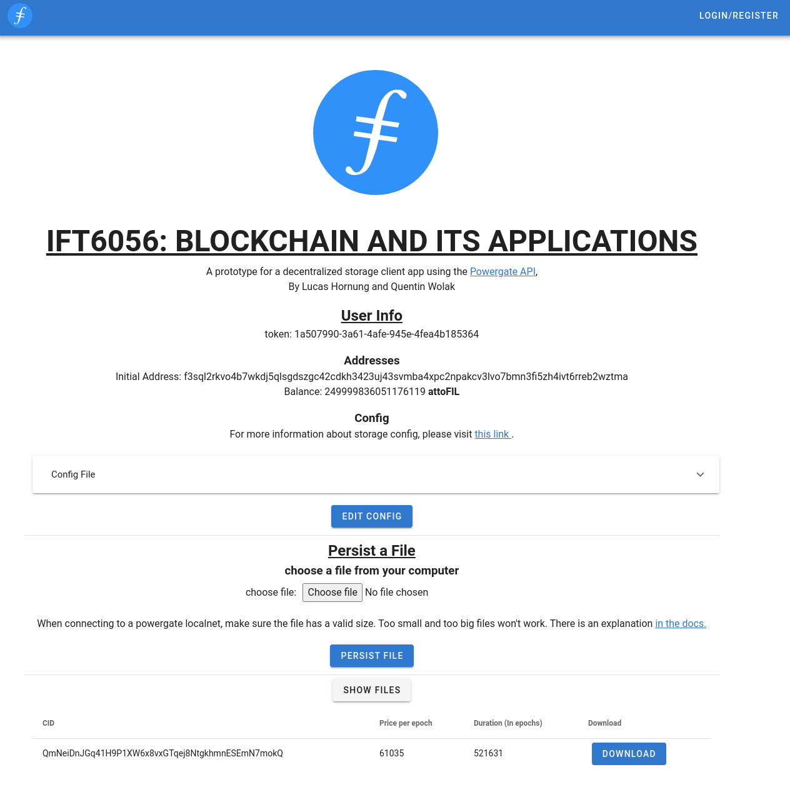
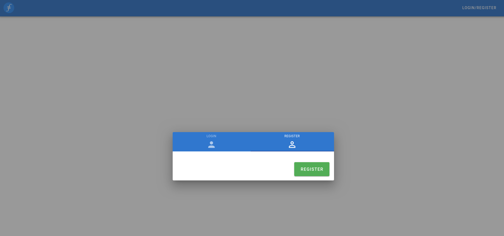
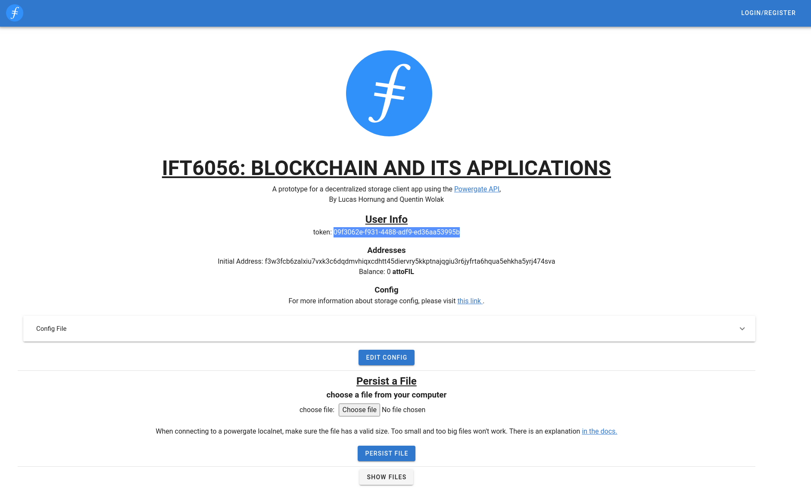
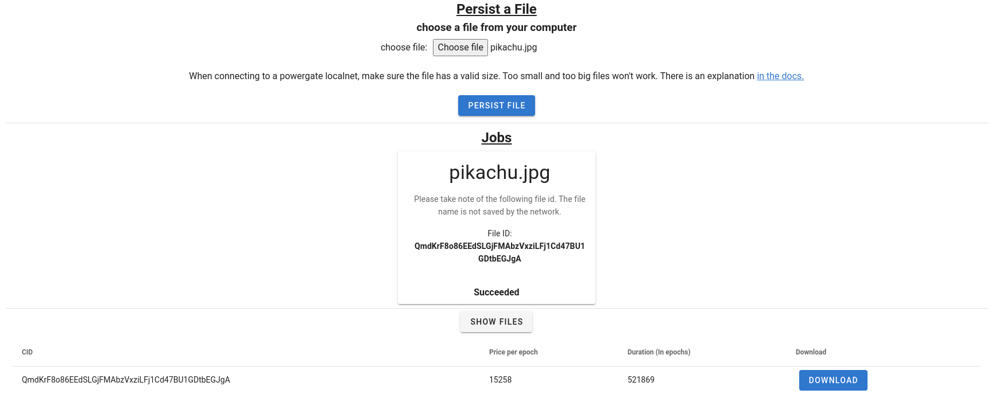
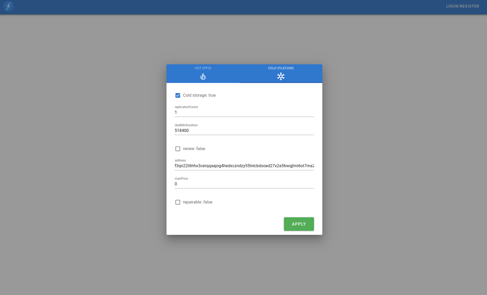

# IFT6056 BLOCKCHAIN AND ITS APPLICATIONS: Prototype for a decentralized cloud storage service interface


## Authors

* Lucas Hornung
* Quentin Wolak

## Requirements
Make sure you match the following requirements in order to run our prototype:
- Linux distribution of your choice (We have tested it using Ubuntu 20.04 LTS)
- Make sure [Docker](https://www.docker.com/) and Cmake are installed in order to run Localnet
- Make sure [Node.js](https://nodejs.org/en/) and [npm](https://www.npmjs.com/get-npm) are installed

## Project setup
1. Navigate to the **powergate-app** folder and run the following command to install the required node librairies
```
npm install
```
2. Download the latest [Powergate Docker Image](https://github.com/textileio/powergate/releases)
### Run 
1. Navigate to the **powergate-docker** folder you just downloaded where the Makefile is and run the following command to start the **localnet** instance:
```
sudo make localnet
```
2. Navigate to the **powergate-app** folder and run the following command:
```
npm run serve
```
3. Go to [http://localhost:8080/](http://localhost:8080/) on your browser.

### Create a new user and upload a file
1. Click on **Login/Register** at the top right corner.
2. Click on the **Register** tab then **Register**.

3. Take note of your token in the **User Info** section, this is how you can log back in the application.

4. Click on the **Choose file** button to select a file to upload and then click **Persist File**.
5. Once your file is uploaded, take note of your file´s CID as Filecoin does not store the name and extension of files uploaded to the network.
6. If you want to download your file, just click on the **Show Files** button and click on the **Download** button corresponding to your file's CID.


### Editing the storage deals config
Suppose you need to have redunduncy, you want to set a maximum price for storing your files, or you want to use a different Filecoin wallet than the one provided by Powergate. By clicking on the Edit Config button, you can edit the Powergate deals settings and adjust these settings to your needs.


### References
The following librairies, APIs and frameworks were used to build this project:
- [Powergate](https://docs.textile.io/powergate/)
- [Powergate JS Client API](https://textileio.github.io/js-powergate-client/)
- [Vuetify](https://vuetifyjs.com/en/)

The following references were used to build this application:
-  [https://github.com/felixniemeyer/example-powergate-web-app](https://github.com/felixniemeyer/example-powergate-web-app)
- [https://www.codeply.com/p/hBkZaWgmnk](https://www.codeply.com/p/hBkZaWgmnk)
